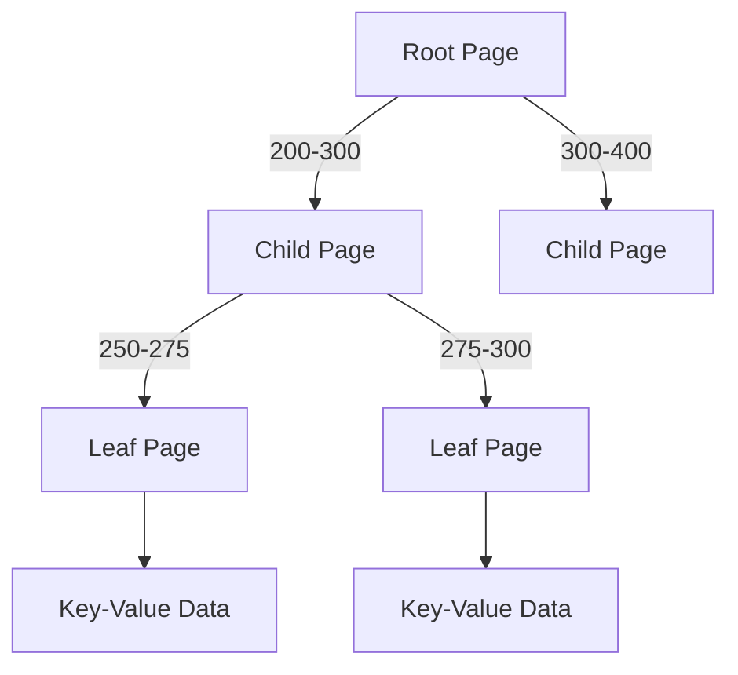

# B-Tree Indexes

## Core Characteristics
- **Hierarchical structure**: Balanced tree of fixed-size pages (typically 4KB)
- **Sorted keys**: Enables efficient lookups and range queries
- **Ubiquitous**: Standard in most relational databases (MySQL, PostgreSQL, etc.)

## Structure Overview

## Key Operations

### Lookup Process
1. Start at root page
2. Follow child pointers using key ranges
3. Progress down to leaf pages
4. Retrieve value (either inline or via reference)

### Insertion Process
1. Find appropriate leaf page
2. If page has space, insert new key-value pair
3. If page is full:
   * Split page into two
   * Update parent page with new key range division
   * May propagate splits up the tree

## Implementation Considerations

### Reliability Mechanisms
* **Write-ahead log (WAL)**: Records all changes before applying
* **Copy-on-write**: Some implementations (e.g., LMDB) use immutable pages
* **Concurrency control**: Latches (lightweight locks) for multi-thread access

### Performance Optimizations
| **Optimization** | **Benefit** |
|------------------|-------------|
| **Key prefix compression** | Higher branching factor |
| **Leaf page linking** | Faster range scans |
| **Sequential layout** | Reduced disk seeks |
| **Fractal trees** | Hybrid log-structured approach |

## Comparison with LSM-Trees
| **Feature** | **B-Trees** | **LSM-Trees** |
|-------------|-------------|---------------|
| **Write pattern** | In-place updates | Append-only |
| **Read speed** | Faster point queries | May need multiple checks |
| **Write speed** | Slower (page splits) | Very high throughput |
| **Space efficiency** | More efficient | Write amplification |
| **Range queries** | Good (sorted keys) | Excellent (sequential) |
| **Concurrency** | Requires locking | Simpler (immutable) |

## Advantages
✔ Predictable performance (O(log n))
✔ Efficient for point queries
✔ Mature and well-understood
✔ Native support in most storage systems

## Limitations
* **Write amplification**: Small writes may require multiple page updates
* **Fragmentation**: Deletions can leave empty space
* **Concurrency complexity**: Requires careful locking
* **Random writes**: Less optimal for SSDs

## Real-World Usage
**Databases using B-trees**:
* MySQL (InnoDB)
* PostgreSQL
* Oracle
* SQL Server
* MongoDB (WiredTiger)

**Variants**:
* B+ trees (common implementation)
* Fractal trees (Tokutek)
* Copy-on-write B-trees (LMDB)

"B-trees have remained the dominant indexing structure for decades due to their excellent balance between read performance, write efficiency, and implementation maturity."

## Key takeaways:
1. B-trees provide consistent O(log n) performance for both reads and writes
2. Fixed-size pages align well with hardware characteristics
3. Require sophisticated crash recovery mechanisms
4. More write-intensive than LSM-trees but better for point queries
5. Continually optimized while maintaining core structure