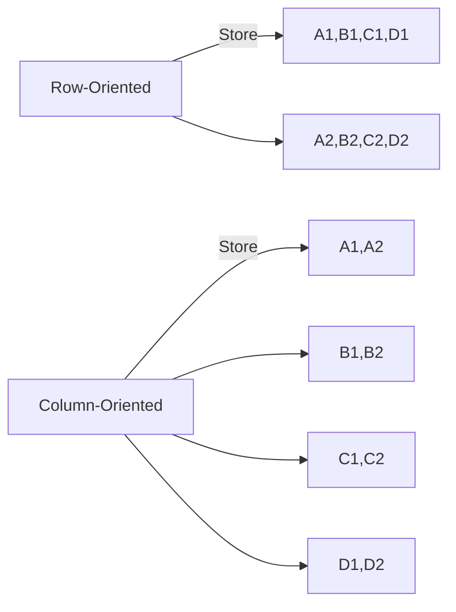

# Column-Oriented Storage for Analytics

## The Challenge with Row Storage
- **Fact tables** often have:
  - Trillions of rows
  - Hundreds of columns
- **Typical analytics queries**:
  - Access only 4-5 columns
  - Scan large row ranges
  - Aggregate values (SUM, AVG, etc.)
- **Row storage inefficiencies**:
  - Must load entire rows
  - Wastes I/O bandwidth
  - Poor cache utilization

## Column Storage Basics


## Key Advantages

### Query Performance
* Only read required columns
* Better compression (similar data together)
* CPU cache efficiency
* Vectorized processing

### Storage Efficiency
* Column-specific compression:
   * Run-length encoding
   * Bitmap encoding
   * Dictionary compression
* Typically 10x compression vs row storage

## Implementation Examples

**File Formats**:
* Parquet (Apache)
* ORC (Hadoop)
* Google's Dremel format

**Databases**:
* Snowflake
* Amazon Redshift
* Google BigQuery
* Vertica

## How It Works

### Query Execution Example
```sql
SELECT weekday, category, SUM(quantity)
FROM sales JOIN dates JOIN products
WHERE year = 2023 AND category IN ('Fruit','Candy')
GROUP BY weekday, category
```

1. Only read:
   * `sales.quantity`
   * `sales.date_key` (for join)
   * `sales.product_sk` (for join)
2. Skip all other 100+ columns
3. Process in compressed format

## Comparison to Row Storage

| **Feature** | **Row-Oriented** | **Column-Oriented** |
|-------------|------------------|---------------------|
| **OLTP** | Excellent | Poor |
| **OLAP** | Poor | Excellent |
| **Write Speed** | Fast | Slow |
| **Compression** | Moderate | Very High |
| **Partial Reads** | Inefficient | Optimal |

## Advanced Techniques
* **Column groups**: For frequently accessed together columns
* **Materialized views**: Pre-computed aggregates
* **Zone maps**: Min/max values for blocks
* **Late materialization**: Delay row reconstruction

## Key Takeaways
1. Column storage revolutionizes analytics performance
2. Achieves massive compression and I/O reduction
3. Enables vectorized query processing
4. Ideal for "wide tables, narrow queries" pattern
5. Now standard for cloud data warehouses