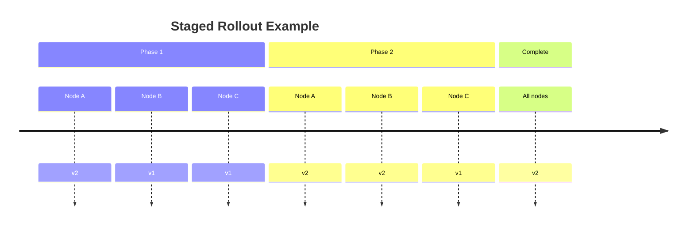

# Data Evolution and Compatibility

## The Challenge of Changing Data Requirements
- Applications inevitably evolve over time:
  - New features require new data fields
  - Business needs drive different data presentations
  - User requirements become better understood

## Schema Management Approaches

### Relational Databases
- **Single schema** enforced at any time
- Changes require explicit migrations (`ALTER TABLE`)
- Strict consistency but rigid evolution path

### Schema-on-Read ("Schemaless") Databases
- Mixed data formats coexist
- No enforced schema validation
- Flexible but requires application-level handling

## The Deployment Reality

### Rolling Upgrades (Server-Side)

# Data Compatibility and Encoding Formats

## Client-Side Applications
* Users control update timing
* Old versions may persist for extended periods

## Compatibility Requirements

### Backward Compatibility
* **Definition**: New code reads old data
* **Implementation**:
   * Maintain old parsing logic
   * Default values for missing fields
   * Generally easier to achieve

### Forward Compatibility
* **Definition**: Old code reads new data
* **Implementation**:
   * Ignore unrecognized fields
   * Preserve unknown data during modifications
   * Requires careful design

## Data Encoding Formats Comparison

| **Format** | **Schema Req.** | **Binary** | **Compatibility Features** |
|------------|-----------------|------------|----------------------------|
| JSON       | No              | No         | Ignore unknown fields      |
| XML        | No              | No         | Ignore unknown elements    |
| Protocol Buffers | Yes       | Yes        | Field numbers, optional    |
| Thrift     | Yes             | Yes        | Field IDs, versioning      |
| Avro       | Yes             | Yes        | Schema resolution          |

## Practical Implementation Guidance

1. **Design for Extension**:
   * Make all fields optional in initial design
   * Avoid strict validation of unknown fields

2. **Versioning Strategies**:
   * Consider explicit version tags in data
   * Support parallel read paths for different versions

3. **Migration Planning**:
   * Maintain compatibility windows during transitions
   * Monitor version adoption before retiring old formats

**Key Principle**: Systems should tolerate mixed versions during transitions while maintaining both backward and forward compatibility.