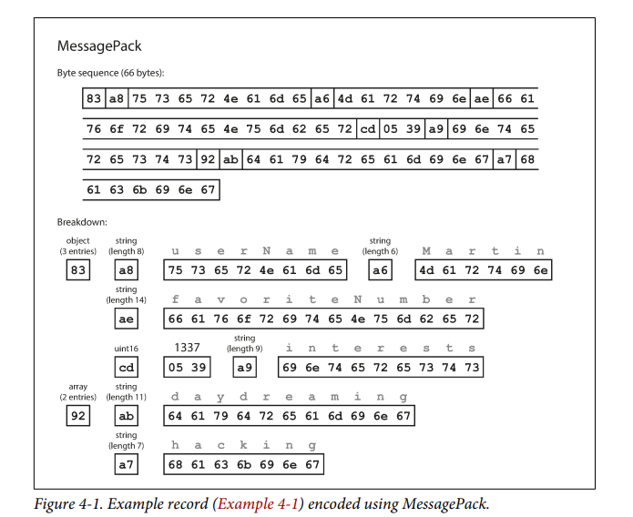
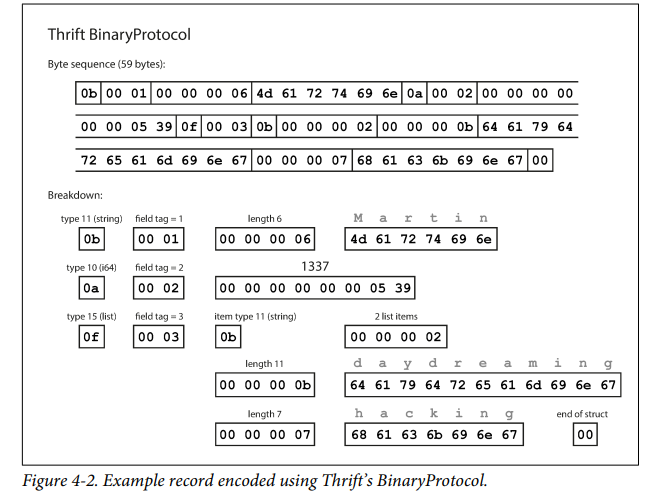
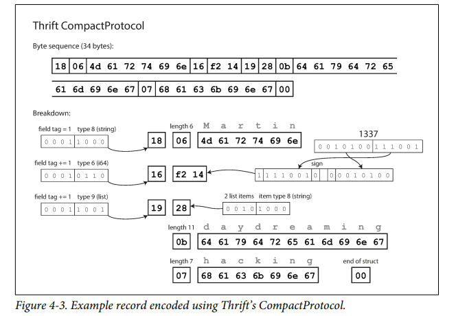
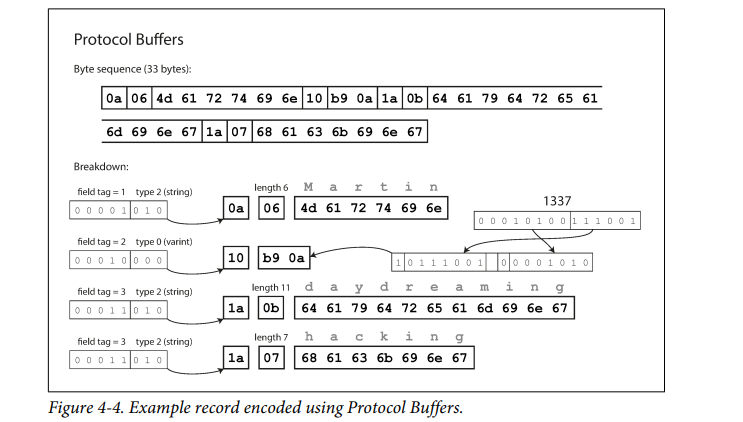
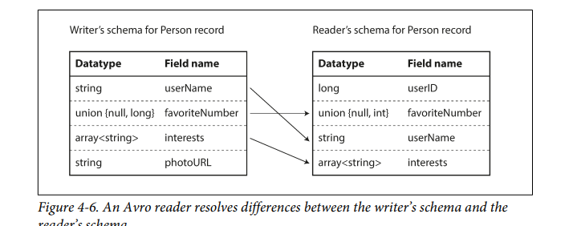
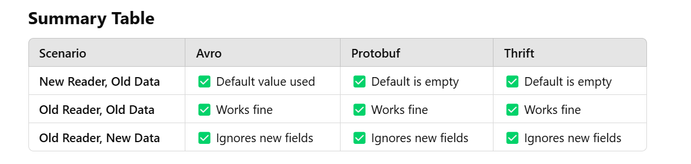

### Encoding
* Staged Rollout (Rolling Upgrade) - Some node have latest application
* Old code and new code coexist with old data and new data
* So Backward and forward compatability should be maintained
### Formats
* JSON
* XML
* Protocal Buffers
* Thrift
* Avro

REST, RPC, message-passing system(actors and message queues)

### Format for encoding data
* In memory (List, Array, Struct, HashTable, Tree) . These DS for efficient access of CPU
* Write to File or Send accross network, enconde in sequence of bytes. This Sequence of bytes look quite different from DS in memory 

* Translation:   
Encoding(Parsing, Serialization, Marshaling): In-memory to byte sequence
Decoding: Byte Sequence to In-memory

### Langage Specific Format
JAVA: java.io.serializable

* encoding tied to one programming language
* decode instantiate arbitary classes. which may be security prone.
* versioning is not done
* CPU time and size of encoding data is problem

### JSON XML Binary Variants 
* XML and CSV -> distinguish between number ans string
* JSON distingusih vetween number and floating IEEE 754
* 2^53 greater than value will be wrong in JS FLoating Point
* Schemas enforced in XML not in JSON
* Support unicode but not binary string

### Binary Encoding 
* Terr Bytes of data encoding have big impact
* JSON and XML space is huge
* profusion -> Binary encoding JSON (BSON, MessgaePack, BISON etc..)
* profusion -> Binary encoding XML (WBXMl, Fast Infoset)

### Message Pack Encoding 


* 0x83 (4 bits with 3 keys)
* Length of key and value
* key, Value in ASCII / UTF

### Thrift and Protocal Buffers

* Both comes with code generation tool that takes a schema definition and produces classes that implements the schema in various programming language
* Your application code can call this
generated code to encode or decode records of the schema.

### Thrift 
* Facebook.
* requires schema

```
struct Person {
 1: required string userName,
 2: optional i64 favoriteNumber,
 3: optional list<string> interests
}
```

##### Formats
###### BinaryProtocal
* Type annotation (indicate string , int)
* key as tag
* Length if data type
* Value in ASCII / UTF

###### CompactProtocal



### Protocal Buffers
* Google protobuf

##### Formats
###### Protocol Buffers




```
message Person {
 required string user_name = 1;
 optional int64 favorite_number = 2;
 repeated string interests = 3;
}
```


#### AVRO

##### AVRO IDL schema - Human editable

```
record Person {
 string userName;
 union { null, long } favoriteNumber = null;
 array<string> interests;
}
```
##### AVRO JSON schema - machine readable

* Nothing to indentify fields or data type
* consist of value concatenated together
* Parsing Binary data you need to go through  the order they appear in the schema use schema data type of each fiels
* so schema is must and mistmacth wont parse
```
{
 "type": "record",
 "name": "Person",
 "fields": [
 {"name": "userName", "type": "string"},
 {"name": "favoriteNumber", "type": ["null", "long"], "default": null},
 {"name": "interests", "type": {"type": "array", "items": "string"}}
 ]
}
```

### Schema Evolution:
### Thrift:
*List
### Protouf:
* repeated field (old code read last)
* single value field to multi value field
### AVRO
Writer schema: encode data using schema version
Readder schema: Decodes data using schema versionn

Both need not to be same they have to compatible.
Decodoes avro lib resolves difference by looking writer and readers and translating from writer to reader.




