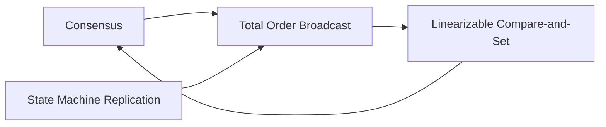

# Total Order Broadcast in Distributed Systems

## Core Concept
- **Definition**: Protocol ensuring two key properties:
  1. **Reliable delivery** - No lost messages (if delivered to one, delivered to all)
  2. **Totally ordered delivery** - Same order across all nodes

- **Equivalent to**: Atomic broadcast, consensus (when implemented correctly)

## Key Applications

### Database Replication
- Enables **state machine replication**
- All replicas apply writes in identical order → consistent state

### Transaction Processing
- Serial execution of deterministic transactions
- Maintains consistency across partitions

### Distributed Coordination
- Implements **linearizable operations** (e.g., compare-and-set)
- Generates **fencing tokens** (e.g., ZooKeeper's zxid)

## Implementation Approaches

### Building Linearizable Storage with Total Order Broadcast
1. **For writes**:
   - Append operation to log
   - Wait for delivery confirmation
   - Check for conflicts (first write wins)
   - Commit/abort based on position

2. **For linearizable reads**:
   - Option 1: Sequence read through log (like etcd quorum reads)
   - Option 2: Sync to latest log position (like ZooKeeper sync())
   - Option 3: Read from synchronously updated replica

### Building Total Order Broadcast with Linearizable Storage
- Use linearizable counter (increment-and-get)
- Attach sequence numbers to messages
- Nodes deliver messages in sequence number order

## Fundamental Connections

## Key Insights
Stronger than timestamp ordering: Order is fixed at delivery time

Enables fault-tolerant coordination: Basis for ZooKeeper/etcd

Equivalent to consensus: Solving one solves the others

Practical trade-off:

Total order broadcast → easier to implement

Linearizability → stronger guarantees

"Total order broadcast provides the foundation for building consistent distributed systems despite failures."