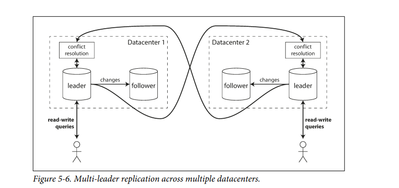
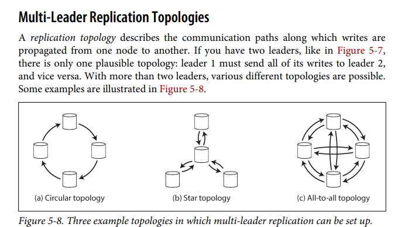

### Multi Leader Replication

### Sinlge Leader:
#### Downside:
1. Only One Leader. All writes done here. If u can't connect to leader then writes wont happen to 

### Multi Leader
* Extension is allow more than one node to write

* Multiple Data Centers
* Each Data Center Normal Single Leader Replication
* Accross the Data Center we will have multi leader

How Multi Leader Fare in comparision to Single Leader
### Performance
* In SL every writes go through single Data Center even though we have multiple Data Center
* Add Significant Latency to writes
* In MLR all writes happen in local Data Center and replicated asynchronously

### Tolerance of Data Center Outages
* In SLR Leader fails , election node promote to leader
* In MLR each Data Center continues to operate independenty and replication catces up when comes back online
### Tolerance of Network Problem
* In SLR when network issue happens the write may block due to sycnhrounous replicas
* In MLR aysnc replication usually tolerate networm problem better

### Problem
* Conncurrent Data Modification at Different Data Center
* Writes Conflics due to this

### Client With Offline Operation:
* Calender App 
* Every Device has local DataBase and acts as Leader (write request)
* Every device is a Leader(Mobile, Desktop). There is Aysnc MLR process between replicas of calender on all devices.
* The replication log depends when turn on internet
* This technique is same as MLR taken to extreme with each device as Data Center

### Collaborative Editing
* In Guarantee No editing conflict , then it's like SLR
* User must obtain lock and release once editng
* Multiple User needs to edit the  avoid locks and unit of change must be very small. MLR with conflict resolution should be handled.

### Handling Write Conflicts

* User 1 changes tile in Dataceneter A
* User2 changes title in DataCneter B
* At same time , now async replication happens and conflict is detected

#### Synchronous versus asynchronous

* In SLR any writes will block or wait for other writes to complete
* In MLR both writes are successfull, conflic is detected when async at some point in time. ao too late to ask user to resolve

### Coflict Avoidance
* avoid them , if application ensusre that al writes for particular record (say title) goes to same leader.

### Convergign towars consisten state
* In SLR write happen sequentially, last write is final value
* IN MLR not defined ordering, no clear final value
* L1 title to B then C, L2 title updated to C and then B due to lag
* So replicas should arrive at the correct and final value 
* Give each write a unique ID(Timestamp, Long UUID). Pick write with highest ID as winner , if ts then last write wins. This prone to data loss
* each replica unique id, write originated at higher numbered is taken precendence. Data Loss prone
* order them and merge values so title will bew (B/C)
* Record conflic in DS and use application code to resolve conflicts at later point in time.

### Custome Conflic resolution
* using Application code
### On Write
* Conflic handler called when conflicts detected i replicated changes
* Runs  in BG 

### On Read
* Conflics are stored.Next time when data is read the Multiple versions of data are returned to application for user or automaticaaly to resolve the conflict (CauchDB)

### Automatic Conflic Resolution
* Conflict Free replication datatypes(CRDT) is family of SET,MAP,ORDER LIST COunnters, this can be concurrently edited which resolves the conflict automaticaly. 2 way merge
* Mergable Persistant Data Struture, track history similar to GIT use three way merge functon 
* Opertational transformations conflic resolution algo behind colloborative editing. Conccurent editing of ordered list of items , such as the list of characters that constitutes a text document

### What is Conflic
* Two wrties to same field at same time
* Meeting booking system : conflict two team booked the same room same time and our system let that happen
* If booking done on different leader and replication happend

### Multi Leader Replication Topologies 

* Topologies defines the communication path along writes are propagated from one node to another

### All to ALL
* Every leader sends its writes to every other leader
* Travel accross differnt path even some node fails
### Circular
* Each node receive writes from one node and forwards the writes
* Write need to pass many nodes through all replicas
* Prevent infinite loops, each node has unique identifier and each log, each write is tagged with this id
* when node recives changes and write has same id then discarded
* One node fails , interupt flow until fixed or comes back
### Star 
* Root node forwards writes to other nodes. Tree 

Causality Issue
* L1 insert a row
* L3 updates the smae row
* L2 view l1 becuase in L2 update happened firest and then insert row. Due to order of writes
* ts is not usefull as clocks cannot be trusted to sync these events

* Version Vectors to order the writes is a technique. But these are poorly implemented in Data Bases 