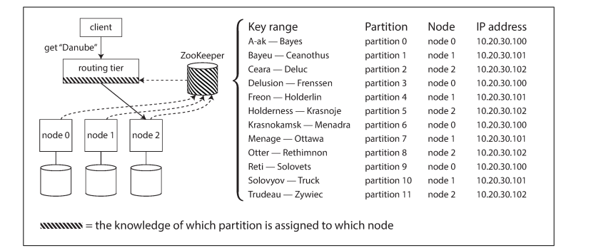

### Partition and Replication
* Records in different nodes
### Replication By key Value
### Replication By Key Range
* Encyclopedia
* Skew and Hostspot
* Data May end up in in partition
Read and Write through put issue
Read:
* May query every node for single data
* May write single node for every data

### Parttion By Hash of Key
* Goal is to make data skewed or hotspot to distribute evenly
* Hash Function
* every key whose hash falls within a partition’s range will be stored in that partition.
### Issue
* Range query is not possible as keys are not adjacent and scattered
* 

### Consistent Hashing
* a way of evenly distributing load across an internet-wide system of caches such as a content delivery network (CDN).

### Skewed Workloads and Relieving Hot Spots
* Read and write end up in same partition
* Celebrity activity. Comment goes to user id
* In Application code randomly adding 2char to userid will make write to 100 keys. which will falll under different partition keys
* But read will be from accross 100 keys in different partition ranges

### Partitioning and Secondary Indexes
* Mostly using primary key.
* Secondary index doesn't identity record uniquely but rather way of searching for occurance of particular value
* Secondary index Bread and Butter for RDBMS and Nosql
* Does not go hand in hand with Partiton

* document-based partitioning
* term-based partitioning

* Within one partition seach by secondary index
* 

### Partitioning Secondary Indexes by Document
* Global index
* Distributed key
* Based Tag por Category
* Science , Technology
* So All Document regarding Tech will partitioned. But GSI will have reference to this 

### Rebalancing Partitions

* The process of moving load from one node in the cluster to another is called reba‐lancing.

Relaning
* Load shared fairly
* While relabalancing read/write should happen
* no more data shoudl be moved for relabalancing

### Strategies
### Mod
* Nodes 10
* userid - 123456 % 10 - 6
* userud - 123456 & 11 - 3

Increase in node make the partition ranges differs. So data should be moved to different partition. This not good as node rebalancing happens often

### Fixed Number of Partitions
* 10 Nodes may split into 1000 partitions
* So 100 parttions assigned to each node
* Fixed parttion length 1000
* Even the change in number of nodes. Only will result in change in entire partition to new node not the just data
* Partition Large: Relabancing and recovering from node failture becomes expensive
* Partition Small: Incur too much overhead
* Correct / Just Partition is needed

### Dynamic Partition:
* Create Partition Dynamically
* When Partition grows configured size(10 GB) split into two partitions so hale data end in each nodes
* When Data Shrinks merged with adjacent partitions
* In HBASE Transfer of happends through HDFS
* nodes proportional to size of data

### Partitioning proportionally to nodes
* Number of partition proportional to nodes
* Fixed nos of partition per node
* Partition grows proportional to datasize
* new node joins cluster chooses fixed number of partitions to split and takes ownership
* Cassandra 256 partitions per node

### Operations: Automatic or Manual Rebalancing

*  does the rebalancing happen automatically or manually?

### manual
*  For example, Couchbase, Riak, and Voldemort generate a suggested partition assignment automatically, but require an administrator to commit it before
it takes effect
* 
Automatic 
* No need for admin
* unpredictable,
* Rebalancing is expensive it requires rerouting and moving large amount of data from one node to another node
* process can overload network and harm other  nodes
* If failure happens 

### Request Routing
* when a client wants to make a request, how does it know which node to connect to
* service discovery
* Zoo Keeper Holds Meta Data About  nodes in the cluster
* Zoo keeper updates it routing tier when any changes in nodes

### Parallel Query Execution

* This is for simple query read/write a single key. This is level of access supported in NoSQL
* MPP (Massively Parallel Processing) for OLAP.
* Warehouse -> join,filter,grouping,and aggregates
* MPP breaks this complex queries into a number of execution stages and partitions which many executed on parallel nodes of DB Cluster
