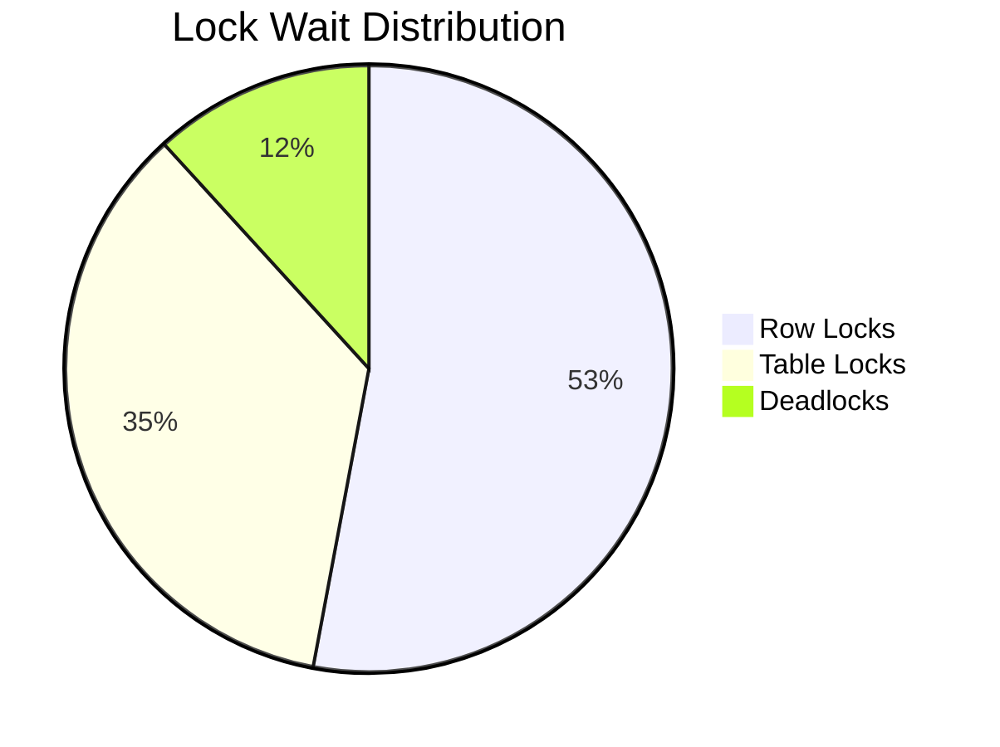

# Weak Transaction Isolation Levels in Databases

## Fundamental Concepts

When two transactions don't access the same data, they can safely execute in parallel. Concurrency issues (race conditions) emerge when:

1. One transaction reads data being modified by another transaction  
2. Two transactions simultaneously modify the same data

### Challenges with Concurrency

- **Heisenbugs**: Timing-dependent issues that rarely occur and are difficult to reproduce  
- **Complex Reasoning**: Hard to predict behavior in large systems with multiple access points  
- **Scalability Issues**: Single-user assumptions break down with concurrent access  

## Isolation Levels Explained

### Serializable Isolation (Ideal but Costly)

- **Theoretical Promise**: Transactions appear to execute sequentially  
- **Practical Reality**: Significant performance overhead (10-100x slower)  

### Read Committed (Most Common Practical Level)

#### Two Core Guarantees:

1. **No Dirty Reads**  
   - Only see committed data

   ```sql
   -- Transaction 1
   BEGIN;
   UPDATE accounts SET balance = 500; -- Uncommitted

   -- Transaction 2
   SELECT balance FROM accounts; -- Sees old value
   ```

2. **No Dirty Writes**  
   - Cannot overwrite uncommitted data

   ```sql
   -- Transaction 1
   BEGIN;
   UPDATE products SET stock = 10 WHERE id = 1;

   -- Transaction 2 BLOCKS
   UPDATE products SET stock = 5 WHERE id = 1;
   ```

#### Implementation Mechanisms:

- **Write Prevention**: Row-level locks

   ```python
   def update_record():
       lock.acquire()
       try:
           # Modify data
       finally:
           lock.release()
   ```

- **Read Prevention**: Multi-Version Concurrency Control (MVCC)

   ```
   [Transaction Timeline Visualization]
   Writer: Writes new version (uncommitted)  
   Reader: Always sees last committed version
   ```

### Why Prevention Matters

#### Dirty Read Dangers:

- **Partial Updates**: Seeing some but not all changes  
  - *Example*: New email appears but unread counter doesn't update  

- **Rollback Hazards**: Observing data that never actually commits  

#### Dirty Write Dangers:

- **Inconsistent State**:  
  - Car sold to Bob but invoice sent to Alice  

- **Logical Corruption**:  
  - Mixed updates from competing transactions  

## Real-World Implementations

| Database     | Read Mechanism     | Write Locking         |
|--------------|--------------------|------------------------|
| PostgreSQL   | MVCC Snapshots     | Row-level Exclusive    |
| Oracle       | Undo Logs          | Row-level Exclusive    |
| SQL Server   | Version Store      | Key-range Locks        |

### Default Configurations

- PostgreSQL, Oracle 11g, SQL Server 2012: **Read Committed**  
- MySQL InnoDB: **Repeatable Read**

## Common Concurrency Problems

### Lost Update Problem

**Scenario:**

```python
# Initial: balance = $1000
# T1: Reads 1000, subtracts 200 → writes 800
# T2: Reads 1000, subtracts 100 → writes 900
# Final balance: $900 (should be $700)
```

**Solutions:**

- **Atomic Operations:**

   ```sql
   UPDATE accounts SET balance = balance - 200
   ```

- **Explicit Locking:**

   ```sql
   SELECT balance FROM accounts FOR UPDATE
   ```

### Phantom Reads

**Example:**

```sql
-- T1: Counts 10 active sessions
-- T2: Adds 3 new sessions
-- T1: Repeats count, now sees 13
```

## Performance Considerations

### Throughput Comparison

| Isolation Level | Read-Only | Write-Heavy | Mixed |
|-----------------|-----------|-------------|-------|
| Read Committed  | 25,000    | 4,200       | 12,000|
| Serializable    | 2,000     | 450         | 1,100 |

### Lock Contention



## Historical Failures

- **Knight Capital (2012)**  
  - $460M loss in 45 minutes  
  - *Cause*: Race condition in order routing  

- **UK Bank System (2015)**  
  - Duplicate payments  
  - *Cause*: Phantom reads during batch processing  

## Best Practices

### Level Selection Guide

| Application Type   | Recommended Level     |
|--------------------|------------------------|
| Financial Systems  | Serializable           |
| E-Commerce         | Repeatable Read        |
| Analytics          | Read Committed         |

### Connection Pool Config

```yaml
# PostgreSQL example
datasource:
  hikari:
    transactionIsolation: TRANSACTION_READ_COMMITTED
```

## References

- ANSI SQL Isolation Levels  
- PostgreSQL MVCC  
- Oracle Concurrency Control

