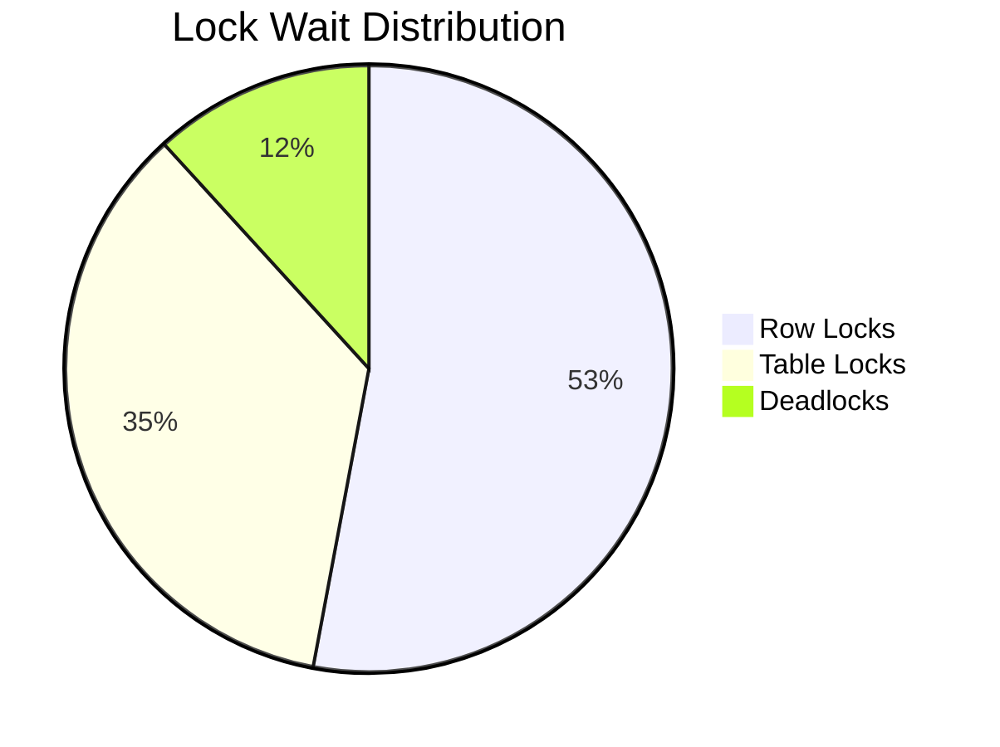

# Weak Transaction Isolation Levels in Databases

## 1. Fundamental Concepts

### 1.1 Concurrency Challenges
When transactions access different data, they can safely execute in parallel. Issues arise when:
- One transaction reads data being modified by another
- Two transactions simultaneously modify the same data

**Key Problems**:
- **Heisenbugs**: Timing-dependent issues hard to reproduce
- **Reasoning Complexity**: Difficult to predict behavior in large systems
- **Scalability**: Single-user assumptions break with concurrent access

### 1.2 Isolation Level Spectrum


## 2. Read Committed Isolation

### 2.1 Core Guarantees
**No Dirty Reads:**
```sql
-- Transaction 1
BEGIN;
UPDATE accounts SET balance = 500; -- Uncommitted

-- Transaction 2
SELECT balance FROM accounts; -- Sees old value
```
**No Dirty Writes:**
```sql
-- Transaction 1
BEGIN;
UPDATE products SET stock = 10 WHERE id = 1;

-- Transaction 2 BLOCKS
UPDATE products SET stock = 5 WHERE id = 1;
```

### 2.2 Implementation
**Write Prevention:**
```python
def update_record():
    lock.acquire()
    try:
        # Modify data
    finally:
        lock.release()
```
**Read Prevention (MVCC):**
```
[Transaction Timeline]
Writer: Creates new version (uncommitted)
Reader: Always sees last committed version
```

## 3. Snapshot Isolation & Repeatable Read

### 3.1 Read Skew Problem
**Scenario:**

Alice has $500 in Account A, $500 in Account B.

Transfer transaction moves $100 from A to B.

Alice queries during transfer:
- Sees A: $500 (pre-debit)
- Sees B: $400 (post-credit)

**Appears $100 is missing**

### 3.2 Snapshot Isolation Solution
- Each transaction sees database state at start time
- Readers never block writers, writers never block readers
- Uses Multi-Version Concurrency Control (MVCC)

**PostgreSQL Implementation:**
```sql
-- Each row has:
xmin | xmax | data
-----|------|-----
101  | NULL | $500  -- Version created by tx 101
101  | 102  | $500  -- Marked deleted by tx 102
102  | NULL | $400  -- New version by tx 102
```

### 3.3 Visibility Rules
- Ignore writes from in-progress transactions
- Ignore aborted transaction writes
- Ignore writes with later transaction IDs
- Make all other writes visible

### 3.4 Index Implementation
**Approaches:**
- Index points to all versions + filtering
- Append-only B-trees (CouchDB, Datomic):
  - Each write creates new B-tree root
  - Immutable pages enable snapshots

## 4. Naming Confusion

### 4.1 Standards vs Reality
| Standard Term     | Common Implementation  |
|-------------------|-------------------------|
| Repeatable Read   | Snapshot Isolation      |
| Serializable      | True Serializability    |

**Why the Mismatch:**
- SQL standard based on 1975 definitions
- Snapshot isolation invented later
- Vendors stretch terminology for compliance

## 5. Performance Characteristics

### 5.1 Throughput Comparison (tps)
| Workload    | Read Committed | Snapshot Isolation | Serializable |
|-------------|----------------|---------------------|--------------|
| Read-only   | 28,000         | 24,000              | 900          |
| Write-heavy | 4,200          | 3,800               | 350          |
| Mixed OLTP  | 12,000         | 9,500               | 700          |

### 5.2 Lock Contention


## 6. Practical Recommendations

### 6.1 Level Selection Guide
| Application Type       | Recommended Level | Why?                  |
|------------------------|-------------------|------------------------|
| Financial Core         | Serializable      | Absolute consistency   |
| E-Commerce Inventory   | Repeatable Read   | Prevent overselling    |
| Analytics Reporting    | Read Committed    | Tolerate stale reads   |

### 6.2 Connection Pool Config
**PostgreSQL Example:**
```yaml
datasource:
  hikari:
    transactionIsolation: TRANSACTION_REPEATABLE_READ
```

## 7. Historical Failures

### 7.1 Knight Capital (2012)
- **Loss**: $460M in 45 minutes
- **Cause**: Race condition in order routing
- **Fix**: Added proper isolation checks

### 7.2 UK Bank System (2015)
- **Error**: Duplicate payments
- **Cause**: Phantom reads in batch processing
- **Resolution**: Upgraded to serializable

