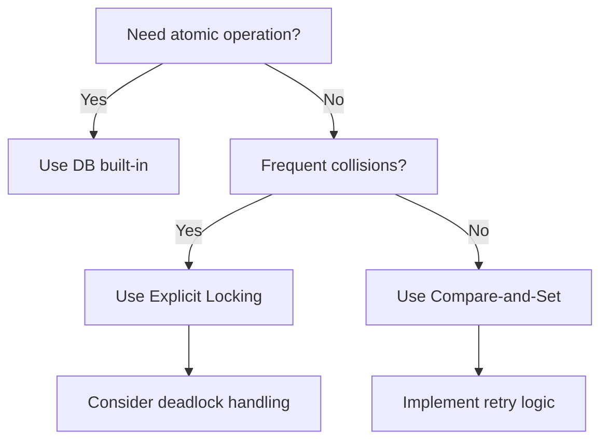
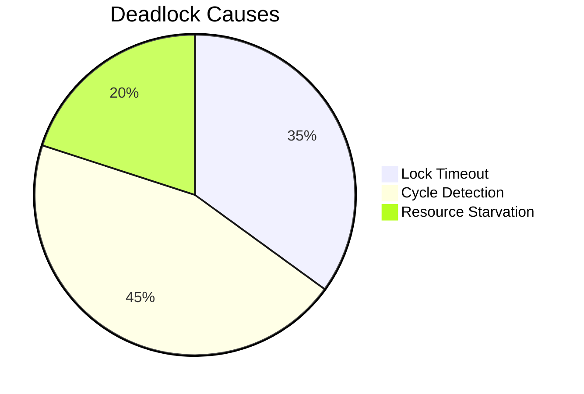

# Weak Transaction Isolation Levels and Lost Update Prevention

## 1. Understanding Lost Updates

### 1.1 The Core Problem
Lost updates occur when:
1. Two transactions read the same value
2. Both modify it independently
3. The second write overwrites the first without incorporating its changes

**Example Scenario**:
```python
# Initial: counter = 10
# Transaction A       # Transaction B
val = read()         val = read()        # Both read 10
val += 5             val += 3
write(val)           write(val)          # Final value: 13 (should be 18)
```

### 1.2 Common Occurrences
- Counter/balance increments
- JSON document modifications
- Collaborative editing (wikis, documents)
- Inventory management systems

## 2. Prevention Techniques

### 2.1 Atomic Write Operations
Most Effective Solution:

```sql
-- SQL Example
UPDATE accounts SET balance = balance + 100 WHERE id = 123;

-- MongoDB Example
db.products.update(
  { _id: 456, stock: { $gt: 0 } },
  { $inc: { stock: -1 } }
);
```

Implementation:
- Uses exclusive locks during read-modify-write
- Often executes on a single thread

### 2.2 Explicit Locking
Pessimistic Approach:

```sql
BEGIN TRANSACTION;
SELECT * FROM inventory 
 WHERE product_id = 789 
 FOR UPDATE;  -- Exclusive lock acquired

-- Application logic...
UPDATE inventory SET stock = stock - quantity 
 WHERE product_id = 789;
COMMIT;
```

Considerations:
- Can cause deadlocks if not managed properly
- Reduces concurrency

### 2.3 Automatic Detection
Snapshot Isolation Variants:

| Database | Isolation Level | Detects Lost Updates? |
|----------|----------------|----------------------|
| PostgreSQL | Repeatable Read | Yes |
| Oracle | Serializable | Yes |
| SQL Server | Snapshot | Yes |
| MySQL/InnoDB | Repeatable Read | No |

How It Works:
- Tracks read sets during transaction execution
- Aborts transactions if write conflicts with prior read

### 2.4 Compare-and-Set (Optimistic Concurrency)
Pattern:

```sql
UPDATE wiki_pages 
SET content = 'New content', version = version + 1
WHERE id = 123 AND version = 4;
```

Requirements:
- Must verify affected rows count
- Requires retry logic on failure

## 3. Replicated Systems Considerations

### 3.1 Multi-Leader/Leaderless Challenges
- No single up-to-date copy
- Asynchronous replication prevents locks

### 3.2 Conflict Resolution Approaches
Commutative Operations:

```javascript
// Riak CRDT example
{
  "type": "counter",
  "increment": 5  // Order doesn't matter
}
```

Last-Write-Wins Problems:
- High probability of lost updates
- Timestamp resolution often inadequate

Recommended Alternatives:
- CRDTs (Conflict-free Replicated Data Types)
- Operational transformation (for text editing)
- Explicit version vectors

## 4. Implementation Guide

### 4.1 Decision Flowchart


### 4.2 Code Examples
Optimistic Concurrency Control:

```python
def update_article(article_id, new_content):
    attempts = 0
    while attempts < MAX_RETRIES:
        version, content = get_article(article_id)
        if validate_change(content, new_content):
            success = execute_update(
                "UPDATE articles SET content=%s, version=version+1 "
                "WHERE id=%s AND version=%s",
                (new_content, article_id, version)
            )
            if success:
                return True
        attempts += 1
    return False
```

Pessimistic Locking:

```java
// Java/JDBC example
public void transferFunds(Connection conn, long fromAcc, long toAcc, BigDecimal amount) {
    try {
        conn.setAutoCommit(false);
        
        // Lock both accounts
        lockAccount(conn, fromAcc);
        lockAccount(conn, toAcc);
        
        // Perform transfer
        withdraw(conn, fromAcc, amount);
        deposit(conn, toAcc, amount);
        
        conn.commit();
    } catch (SQLException e) {
        conn.rollback();
        throw e;
    }
}
```

## 5. Performance Considerations

### 5.1 Throughput Impact

| Technique | Read Throughput | Write Throughput | Concurrency |
|-----------|----------------|-----------------|------------|
| Atomic Operations | High | Medium | High |
| Explicit Locks | Medium | Low | Low |
| Automatic Detection | High | Medium | High |
| Compare-and-Set | High | Medium | High |

### 5.2 Deadlock Statistics


## 6. Best Practices
- Prefer Atomic Operations when possible
- Use Lock Timeouts to prevent indefinite waits
- Implement Retry Logic for optimistic approaches
- Monitor Contention metrics
- Test Under Load with realistic concurrency patterns

## 7. Historical Failures

### 7.1 E-Commerce Inventory Mismanagement
- Issue: Overselling hot products
- Root Cause: Lost updates during flash sales
- Fix: Implemented row-level locking

### 7.2 Banking System Glitch
- Error: Incorrect balance calculations
- Cause: Missing lock during batch processing
- Resolution: Added proper isolation levels