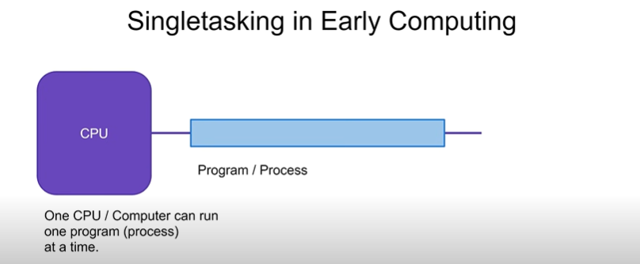
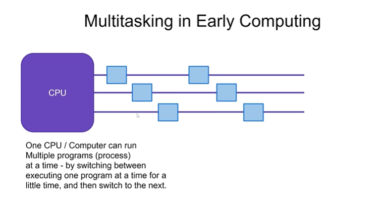
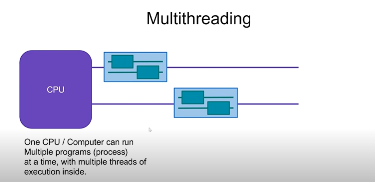
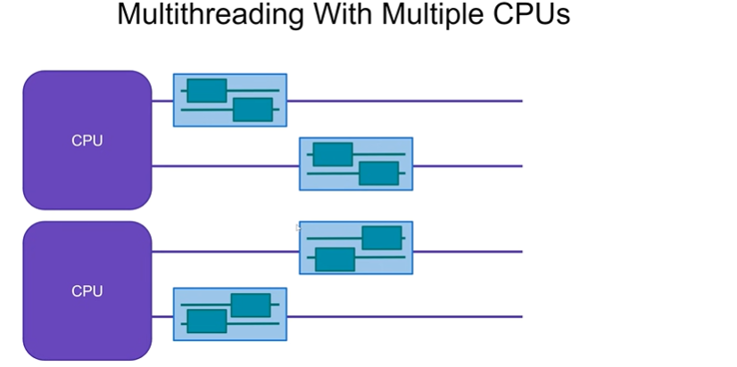
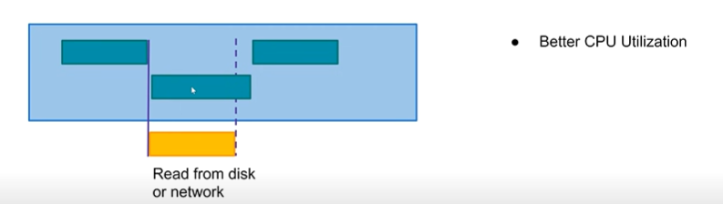
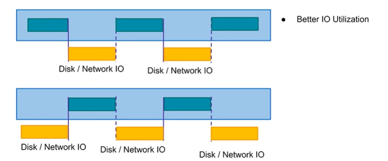
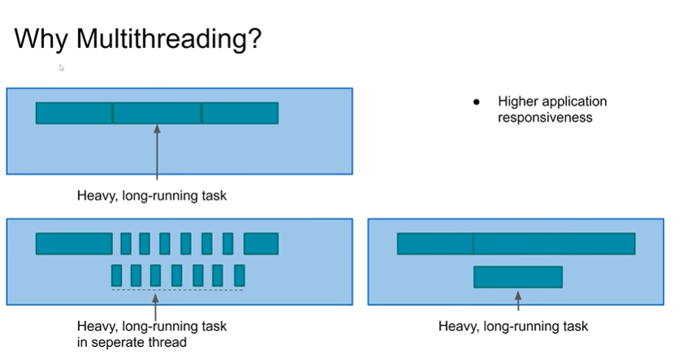
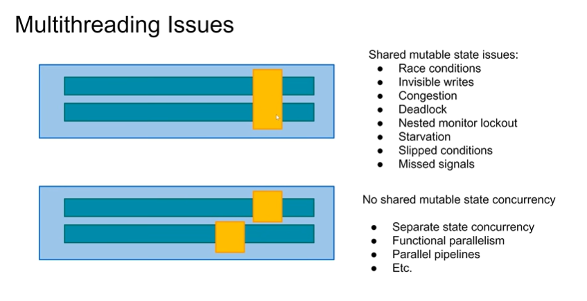

# Java Multithreading and Concurrency - Conceptual Overview

## 1. Evolution of Execution Models

### Single-Task Processing
- Early computers could only run **one program at a time**
- Users had to manually close one program to open another
- Inefficient workflow with frequent application switching

### Multitasking
- **Multiple applications** can run simultaneously
- CPU rapidly switches between applications
- Achieved through:
  - Operating system coordination
  - CPU hardware support for task switching
- Creates illusion of parallel execution

### Multithreading
- Extension of multitasking **within a single application**
- Multiple threads of execution in one program
- Threads share same memory space but have independent execution paths

## 2. Modern Hardware Context

### Multi-Core/Multi-CPU Systems
- Modern computers have:
  - Multiple CPUs **or**
  - Single CPUs with multiple cores
- Enables **true parallel execution**:
  - Different threads can run simultaneously on different cores
  - No context switching needed for parallel threads

## 3. Benefits of Multithreading

### 1. Better CPU Utilization
- Example scenario:
  - Thread A waits for I/O (disk/network)
  - CPU switches to Thread B instead of idling
- Eliminates wasted CPU cycles during I/O waits

### 2. Improved I/O Utilization
- Overlaps CPU and I/O operations:
  - While Thread 1 performs I/O, Thread 2 uses CPU
  - While Thread 2 performs I/O, Thread 1 uses CPU
- Maximizes both CPU and I/O bandwidth usage

### 3. Enhanced Application Responsiveness
- Critical for GUI applications:
  - Main thread handles UI interactions
  - Background threads handle long-running tasks
- Prevents UI freezing during heavy operations
- Especially effective on multi-core systems:
  - UI thread and worker thread can run truly in parallel

## 4. Concurrency Models

### Shared Mutable State Model
- Traditional approach
- Threads **share access** to same memory
- Problems:
  - Race conditions
  - Deadlocks
  - Starvation
  - Visibility issues
- Requires careful synchronization

### Alternative Models
1. **Separate State Concurrency**:
   - Threads communicate via messages
   - No shared mutable state
2. **Functional Parallelism**:
   - Immutable data structures
   - Pure functions
3. **Parallel Pipelines**:
   - Data flows through processing stages

## 5. Key Concepts

### Thread Execution
- Managed by OS thread scheduler
- Each thread gets small time slices
- Context switches between threads are rapid
- On multi-core: True parallel execution possible

### Thread vs Process
| Characteristic | Thread | Process |
|----------------|--------|---------|
| Memory Space | Shared | Isolated |
| Creation Cost | Low | High |
| Communication | Direct (shared mem) | IPC required |
| Fault Isolation | None | Strong |

## 6. Practical Implications

### When to Use Multithreading
- I/O-bound applications
- CPU-intensive tasks (on multi-core)
- GUI applications
- Server applications handling multiple clients

### Challenges
- Increased complexity
- Hard-to-reproduce bugs
- Performance overhead from synchronization
- Difficult debugging

## 7. Learning Path
For implementation details:
- Java Thread class
- Synchronization mechanisms
- Concurrent collections
- Executor framework
- Atomic variables

### Single Tasking 
* Only one task at a time
* Excel should be closed for word

### Multi Tasking
* CPU execute one application/process at a time
* Context switch / time slicing 

### Multi Threading
* Each Application/Process can have multiple thread 
* CPU execute one task at a time but this time OS/CPU will decide which thread to execute

* Multi core machines can execute different thread of same process in different core 

### Why Multithreading
* Better CPU Utilization

* Better IO Utitlization

* Beeter Responsiveness

### Issues

