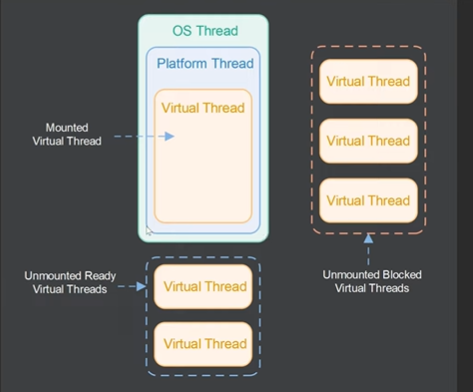

### Virtual Threads in Java

Virtual threads are a new construct introduced in Java 19. This document explores how they work and how they differ from platform threads in Java.



## Overview
- Existing threads in Java are now referred to as **platform threads**.
- A **platform thread** is executed by an **operating system thread**.
- A **virtual thread** is executed by a **platform thread**, which in turn is executed by an **operating system thread**.

## How Virtual Threads Work
1. When a virtual thread is created, it is **not immediately executed** but is instead queued internally in the Java platform.
2. When a platform thread is **ready**, it picks a virtual thread from the queue and executes it.
3. The **JVM maintains a pool of platform threads**, roughly equal to the number of CPU cores available on the machine.
4. If a virtual thread performs a **blocking operation** (e.g., a network call or waiting for a concurrent data structure signal), it is **unmounted** from the platform thread.
5. The platform thread can then **pick another ready virtual thread** for execution, increasing efficiency.
6. Once the blocking operation completes, the virtual thread is **returned to the ready queue** and rescheduled.

## Benefits of Virtual Threads
- **Efficient Resource Utilization**: Virtual threads prevent platform threads from being blocked, allowing them to execute other tasks.
- **High Scalability**: Unlike platform threads, virtual threads require fewer resources (especially memory). Running **millions of virtual threads** is feasible, whereas the same number of platform threads would be impractical.

## Creating Virtual Threads
- Virtual threads are created using:
  ```java
  Thread.startVirtualThread(() -> {
      // Task to execute
  });
  ```
- Alternatively, to create but not start immediately:
  ```java
  Thread virtualThread = Thread.ofVirtual().unstarted(() -> {
      // Task to execute
  });
  virtualThread.start();
  ```
- Virtual threads are still instances of `java.lang.Thread`.

## Example: Running 100,000 Virtual Threads
```java
List<Thread> threads = new ArrayList<>();
int virtualThreadCount = 100000;

for (int i = 0; i < virtualThreadCount; i++) {
    Thread thread = Thread.startVirtualThread(() -> {
        int result = 0;
        for (int j = 0; j < 1000; j++) {
            result += j;
        }
        System.out.println(result);
    });
    threads.add(thread);
}

for (Thread thread : threads) {
    thread.join();
}
```
- This example successfully runs **100,000 virtual threads** without memory issues.

## Preview Feature in Java 19
- Virtual threads are still a **preview feature** in Java 19.
- To enable them in **IntelliJ IDEA**, enable **preview features** in the project settings.
- When running from the **command line**, use:
  ```sh
  java --enable-preview -jar YourApp.jar
  ```

## Conclusion
Virtual threads provide an efficient way to handle concurrent workloads by reducing memory consumption and improving execution efficiency. While still in preview, they are expected to play a crucial role in modern Java applications.

---

*For more information, check out official Java documentation or related tutorials.*


