### Memory Model


# Java Thread Stacks and Heap Memory

## Overview

This document explains how Java threads access memory and how memory is organized inside the Java Virtual Machine (JVM). The explanation covers the concepts of thread stacks and heap memory, along with code examples illustrating how variables and objects are stored and shared.

---

## Java Memory Model

### Thread Stacks and Heap

- Each thread has its own **thread stack**, which contains:
  - Method-local primitive variables
  - References to objects in the heap
- The **heap** is a shared memory area accessible by all threads, storing:
  - Objects instantiated during runtime
  - Static fields shared across all threads

### Key Rules:

1. **Local variables** (primitives and references) are stored on the thread stack.
2. **Objects themselves** are stored on the heap.
3. **Multiple threads can reference the same object on the heap.**
4. **Local variables are never shared between threads.**
5. **Instance variables (fields) are stored in objects on the heap and can be shared.**

---

## Code Example: Local Variable vs Shared Object

```java
public class ThreadMemoryDemo {
    public static void main(String[] args) {
        Runnable task = new MyRunnable();
        Thread thread1 = new Thread(task);
        Thread thread2 = new Thread(task);
        
        thread1.start();
        thread2.start();
    }
}

class MyRunnable implements Runnable {
    private int count = 0; // Instance variable (Heap, shared if runnable is shared)

    @Override
    public void run() {
        int localVar = 0; // Local variable (Thread stack, NOT shared)
        localVar++;
        count++;
        System.out.println(Thread.currentThread().getName() + " - localVar: " + localVar + ", count: " + count);
    }
}
```

### Explanation:

- `localVar` is a **local variable**, stored in the thread stack → **Not shared**.
- `count` is an **instance variable**, stored in the heap → **Shared if the same ****`MyRunnable`**** instance is used.**

#### Output Example (if sharing `MyRunnable` instance):

```
Thread-0 - localVar: 1, count: 1
Thread-1 - localVar: 1, count: 2
```

Each thread has its own `localVar`, but `count` is shared across threads.

---

## Sharing Objects Between Threads

To explicitly share an object between threads, pass a reference to it:

```java
class MyRunnable implements Runnable {
    private MyObject sharedObject;

    public MyRunnable(MyObject obj) {
        this.sharedObject = obj;
    }

    @Override
    public void run() {
        System.out.println(Thread.currentThread().getName() + " - " + sharedObject);
    }
}

public class SharedObjectExample {
    public static void main(String[] args) {
        MyObject obj = new MyObject(); // Shared object on the heap
        Runnable task1 = new MyRunnable(obj);
        Runnable task2 = new MyRunnable(obj);
        
        Thread thread1 = new Thread(task1);
        Thread thread2 = new Thread(task2);
        
        thread1.start();
        thread2.start();
    }
}
```

Now, both threads reference the **same** `MyObject` instance.

---

## Summary

- **Thread stacks**: Store method-local variables; each thread has its own stack.
- **Heap memory**: Stores objects; shared among all threads.
- **Local variables**: Exist in a thread's stack, unique per thread.
- **Instance variables**: Exist in objects on the heap, can be shared.
- **Sharing objects between threads**: Objects on the heap can be accessed by multiple threads via references.

Proper synchronization is necessary when modifying shared objects to prevent race conditions.

---

### Further Reading

- Java Memory Model (JMM)
- Synchronization and Volatile in Java
- Java Concurrency Utilities

---

# Java Memory Model (JMM)

## Overview
The **Java Memory Model (JMM)** defines how threads interact through memory and what behaviors are allowed in concurrent execution. It ensures consistency and correctness of shared data across multiple threads in a Java application.

## Key Memory Areas in Java
The Java Memory Model is divided into several key areas:

### 1. **Heap Memory**
   - The heap is the runtime memory area where objects are allocated.
   - It is shared among all threads.
   - It is divided into different generations:
     - **Young Generation** (Eden, Survivor Spaces)
     - **Old Generation** (Tenured)
     - **Metaspace** (Class metadata storage)

### 2. **Stack Memory**
   - Each thread has its own stack.
   - Stores method-specific local variables, return addresses, and partial results.
   - Each method call creates a new frame in the stack, which is removed after execution.

### 3. **Method Area (Metaspace in Java 8+)**
   - Stores class metadata, static variables, and runtime constant pools.
   - Shared across all threads.

### 4. **PC Register**
   - Each thread has its own **Program Counter (PC) Register**.
   - It holds the address of the currently executing instruction.

### 5. **Native Method Stack**
   - Used for executing native (non-Java) code, such as JNI (Java Native Interface) calls.

## Java Memory Model and Concurrency
### **1. Atomicity, Visibility, and Ordering**
The JMM ensures:
   - **Atomicity**: Operations like `volatile` variables and synchronized blocks provide atomic access.
   - **Visibility**: Changes made by one thread are visible to others (via `volatile`, `synchronized`).
   - **Ordering**: Ensures execution order through happens-before relationships.

### **2. Volatile Keyword**
   - Guarantees visibility of changes to a variable across threads.
   - Prevents instruction reordering.

### **3. Synchronized Blocks**
   - Ensures atomicity and visibility.
   - Allows only one thread to execute a block at a time.

### **4. Happens-Before Relationship**
   - Defines order guarantees between operations:
     - Unlocking a monitor happens-before locking it again.
     - Writing to a `volatile` variable happens-before reading it.
     - Thread start (`Thread.start()`) happens-before the first instruction of that thread.

## Garbage Collection (GC)
Java automatically manages memory via **Garbage Collection (GC)**:
   - **Minor GC**: Cleans up young generation memory.
   - **Major GC**: Cleans up old generation memory.
   - **Full GC**: Cleans all areas, including metaspace.
   - Common GC algorithms: Serial GC, Parallel GC, G1 GC, ZGC.

## Best Practices for Memory Management
- Use **weak references** for caches (`WeakReference`, `SoftReference`).
- Use **StringBuilder** instead of `String` for mutable strings.
- Avoid **memory leaks** by closing resources (files, streams).
- Tune **Garbage Collector (GC)** using JVM options (`-XX:+UseG1GC`).

## Conclusion
Understanding the **Java Memory Model** is essential for writing efficient, thread-safe Java applications. Proper use of synchronization, volatile variables, and memory management strategies helps prevent concurrency issues and optimize performance.

---


* Local varibale will be created in both thread
* Instance varibales are shared between thread

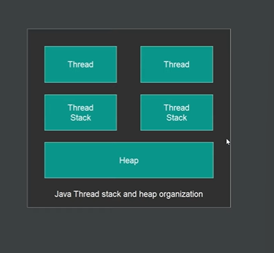
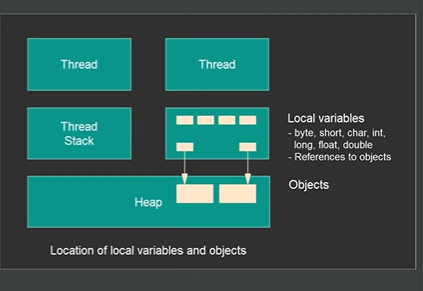

* How Architecture Looks Like
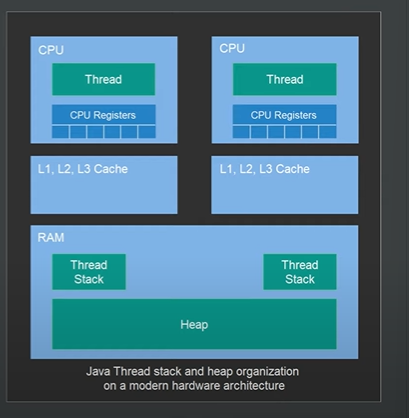
* How Data FLows from RAM to CPU 
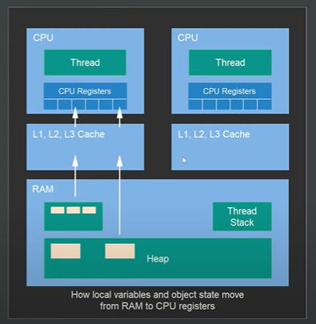
* Shared Data between two threads that executing same time 
* As both object performs and write back to Heap
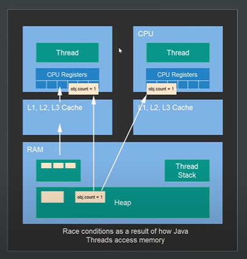
* We Lost an opertation due to parallel processing and shared state
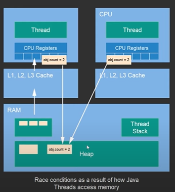
* We Lost an opertation due to parallel processing and shared state
* Data Write Visibility between thread to changes in varibales
* We have no guarantee when writes happen so other thread can see updated or state record
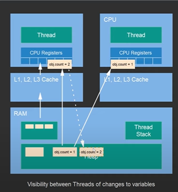
* When write data from register to RAM happens through Cache
* Cache coherance
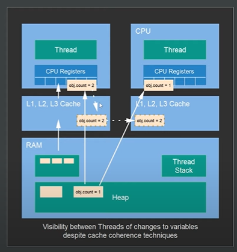

### Guarantee

### Happens Before Guarantee

* Happens-Before relationship ensures that changes made by one thread are visible to another thread.

* CPU Looks ahead of instruction to execute for parallism
* This may be a problem for multithreading application with shared objects
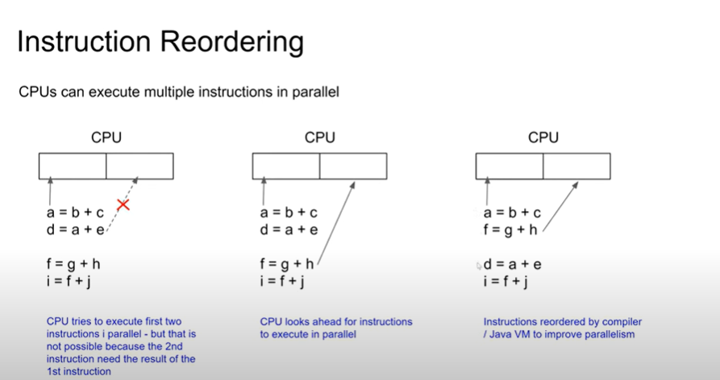
* FramerExchange application is in Main Memory
* T1 storeFrame.produces frame to draw on screen
* T2 takeFrame. consume frame and draw on screen
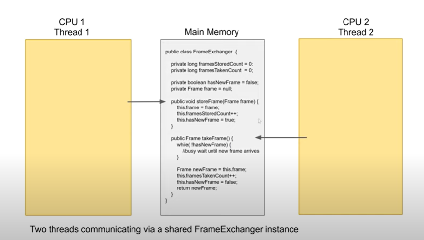
* For Illustration Lets Move the Code to Thread 
* Actual one copy stored in main memeory
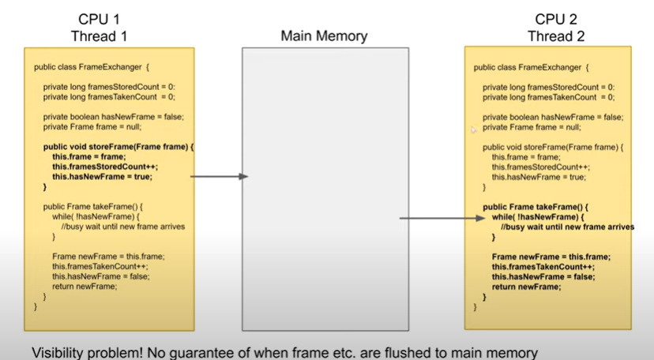
* Volatile - Addressed the visibility problem
* Flushes to main memory 
* All Threads read from Main Memory instead of local core cache
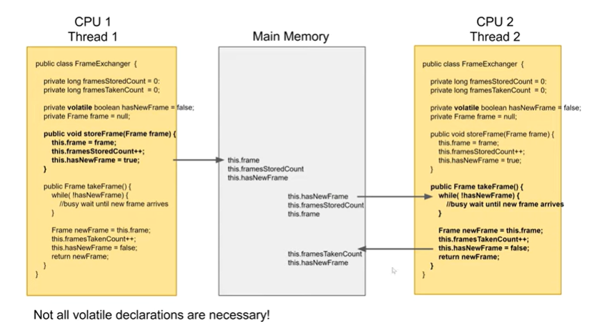

* Inside storeFrame since each varibles is independent
* The CPU will reorder the instruction for parallel processing
* This may end up with some data flushed with old value as the volatile varible assignment is called earlier
* Reorder should not happen after volatile varibale
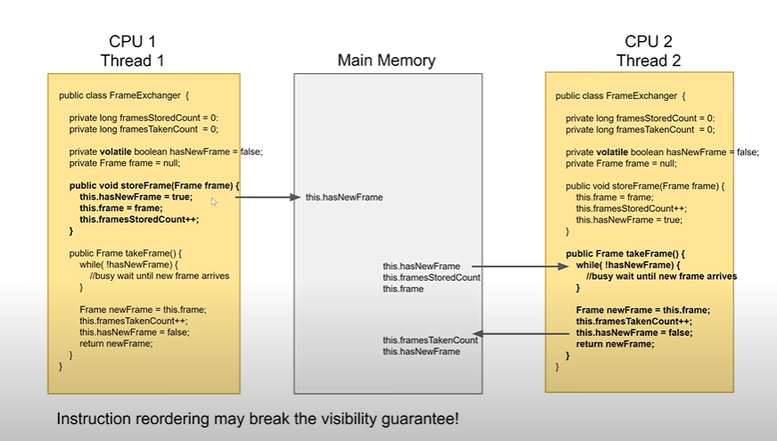

Note

A Set of restrictions on instructions reordering to avoid instrtuction reordering breaking the Java visibility guarantees