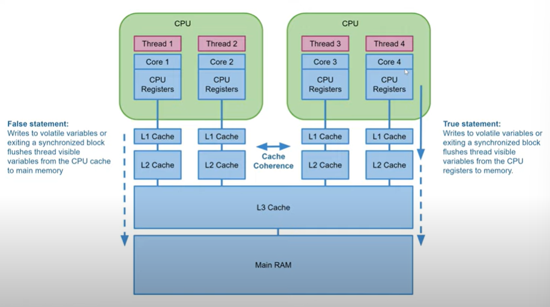

# CPU Cache Coherence in Java Concurrency

## Understanding Memory Model Accuracy

### Common Misconception

There has been a common simplification in explaining Java's concurrency model:

> "Writes to volatile variables or exiting a synchronized block flushes thread visible variables from CPU cache to main memory."

This simplified explanation suggests direct transfers between CPU caches and main memory, but this doesn't accurately reflect what happens at the hardware level.

### The Reality

The actual behavior is more nuanced:

> "Writes to volatile variables or exiting a synchronized block flushes thread visible variables from CPU registers to main memory."

The key distinction is that the flush happens from **CPU registers** (not CPU caches) to main memory.

## Memory Hierarchy in Modern Computers

In modern computer architectures, the path data takes includes:

1. **CPU Registers** - Ultra-fast storage inside the CPU core
2. **CPU Cache** - Multiple levels of fast memory close to the CPU (L1, L2, L3)
3. **Main Memory** - RAM

When a thread writes data:
- The data is first moved from CPU registers to CPU cache
- From the cache, it will eventually be synchronized to main memory
- The timing of the flush from cache to main memory is controlled by the hardware

## Cache Coherence Protocol

### What is Cache Coherence?

Cache coherence is a hardware mechanism that ensures all CPU cores have a consistent view of memory, even when that memory is cached in multiple places.

### How Cache Coherence Works

1. When CPU Core 1 accesses data at a specific memory address, it may store that data in its cache
2. If CPU Core 3 also accesses the same memory address, the cache coherence protocol manages consistency
3. If Core 3 modifies the data (writes to that address):
   - The modified value is stored in Core 3's cache
   - The cache coherence protocol makes this change visible to all other cores
   - Core 1 will see the updated value, even if the data hasn't yet been flushed to main memory

### Benefits for Java Concurrency

Cache coherence means that:
- Changes to volatile variables become visible to other threads immediately
- The hardware doesn't necessarily need to flush the data all the way to main memory for other threads to see the changes
- Data visibility between threads can be maintained at the cache level

## Memory Management in Hardware

### Cache Eviction

The hardware will eventually flush modified data from caches to main memory, typically when:
- The cache needs space for new data
- The cache line is being evicted
- The system needs to maintain memory coherence across multiple CPUs

### Application Transparency

The exact timing of cache flushes is:
- Determined by the hardware
- Not visible to the application
- Not predictable from the Java code perspective

## Implications for Java Developers

Understanding cache coherence helps Java developers by:

1. Providing a more accurate mental model of how `volatile` and `synchronized` actually work
2. Explaining why memory visibility guarantees can be efficient on modern hardware
3. Clarifying that the simplified "cache to main memory" model is an approximation of the actual hardware behavior

## Summary

- Java's memory model abstracts hardware details, but understanding those details can be helpful
- Volatile variables and synchronized blocks flush data from CPU registers, not directly from CPU caches
- Cache coherence ensures visibility of updated values across CPU cores without always requiring writes to main memory
- The timing of cache-to-memory flushes is managed by the hardware and invisible to the application

