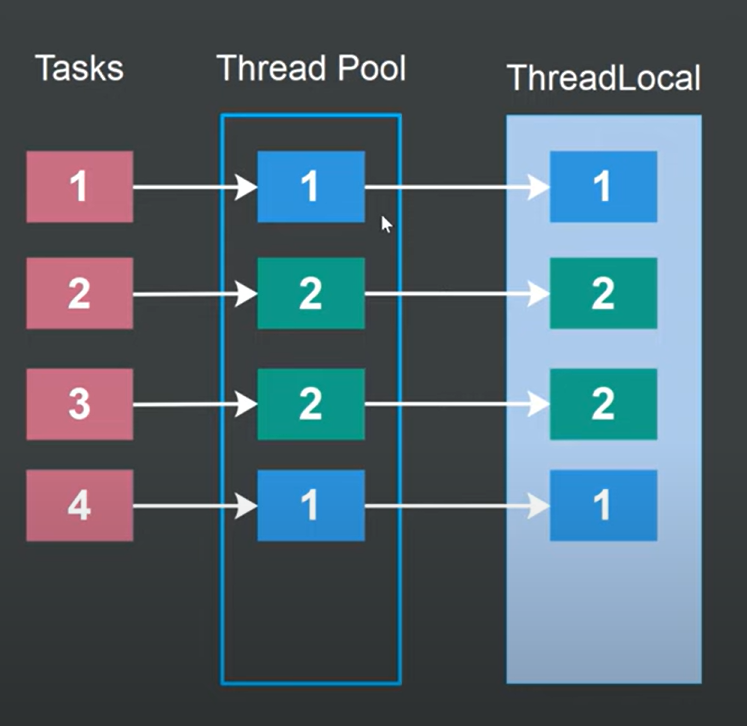

# Java ThreadLocal Documentation

## Introduction

The `ThreadLocal` class in Java provides thread-local variables, which store values that are accessible only to the thread that created them. Unlike normal variables shared between threads, each thread accessing a ThreadLocal has its own, independently initialized copy of the variable.

## Core Functionality

### Basic Usage

A `ThreadLocal` instance maintains separate values for each thread that accesses it:

```java
// Create a ThreadLocal of String type
ThreadLocal<String> threadLocal = new ThreadLocal<>();

// Set a value (specific to the current thread)
threadLocal.set("thread-specific value");

// Get the value (returns the value set by the current thread)
String value = threadLocal.get();
```

### Key Methods

- **`set(T value)`**: Sets the current thread's copy of this thread-local variable to the specified value.
- **`get()`**: Returns the value in the current thread's copy of this thread-local variable.
- **`remove()`**: Removes the current thread's value for this thread-local variable.

## Behavior Details

### Thread Isolation

Each thread that accesses a ThreadLocal has its own, independently initialized copy of the variable:

- When thread A sets a value, it's only visible to thread A
- When thread B sets a value, it's only visible to thread B
- Values set by different threads do not interfere with each other

### Initial Values

There are two ways to provide initial values for ThreadLocal variables:

1. **Extending ThreadLocal class**:
   ```java
   ThreadLocal<MyObject> threadLocal = new ThreadLocal<MyObject>() {
       @Override
       protected MyObject initialValue() {
           return new MyObject();
       }
   };
   ```

2. **Using the static factory method**:
   ```java
   ThreadLocal<MyObject> threadLocal = ThreadLocal.withInitial(() -> new MyObject());
   ```

Notes on initial values:
- Each thread gets its own, separate initial value instance
- Initial values are created lazily when first accessed by each thread
- Initial values are not shared between threads

### Lazy Initialization

An alternative to using initial values is lazy initialization:

```java
MyObject value = threadLocal.get();
if (value == null) {
    value = computeValue();  // Compute based on thread context
    threadLocal.set(value);
}
```

This approach is useful when:
- The initial value depends on thread context
- The value cannot be determined at application startup
- The value needs to be calculated at runtime

## InheritableThreadLocal

The `InheritableThreadLocal` class extends `ThreadLocal` to provide inheritance of values from parent thread to child thread:

```java
InheritableThreadLocal<String> inheritableThreadLocal = new InheritableThreadLocal<>();
```

Key differences:
- Child threads inherit the parent thread's value of InheritableThreadLocal variables
- Regular ThreadLocal variables do not pass values to child threads
- Only the thread that creates a new thread is considered its parent

## Usage with Thread Pools

When using ThreadLocal with thread pools, special considerations apply:

- Values are unique per thread, not per task
- Multiple tasks executed by the same thread will share ThreadLocal values
- Tasks should clean up ThreadLocal values after use to avoid affecting other tasks
- Consider using `remove()` after task completion to prevent memory leaks

## Best Practices

1. **Clean up when done**: Call `remove()` when you're done with a ThreadLocal value to prevent memory leaks
2. **Use with caution in thread pools**: Be aware that values persist between tasks executed by the same thread
3. **Consider initialization needs**: Choose between initial values and lazy initialization based on your requirements
4. **Use InheritableThreadLocal when appropriate**: Only use when parent-child value inheritance is needed

## Example: Complete ThreadLocal Usage

```java
public class ThreadLocalExample {
    // ThreadLocal with initial value
    private static ThreadLocal<String> threadLocal = 
        ThreadLocal.withInitial(() -> "Initial Value");
    
    public static void main(String[] args) {
        Thread thread1 = new Thread(() -> {
            System.out.println("Thread 1 initial value: " + threadLocal.get());
            threadLocal.set("Thread 1 Value");
            System.out.println("Thread 1 new value: " + threadLocal.get());
            
            // Always good practice to remove when done
            threadLocal.remove();
        });
        
        Thread thread2 = new Thread(() -> {
            System.out.println("Thread 2 initial value: " + threadLocal.get());
            threadLocal.set("Thread 2 Value");
            System.out.println("Thread 2 new value: " + threadLocal.get());
            
            threadLocal.remove();
        });
        
        thread1.start();
        thread2.start();
    }
}
```

