### Virutal Memory

* Entire RAM is split into equal size partitions called Page frames
* Each Page Frame is 4KB each
* Process split into equal block sixe
* block size = page frame size
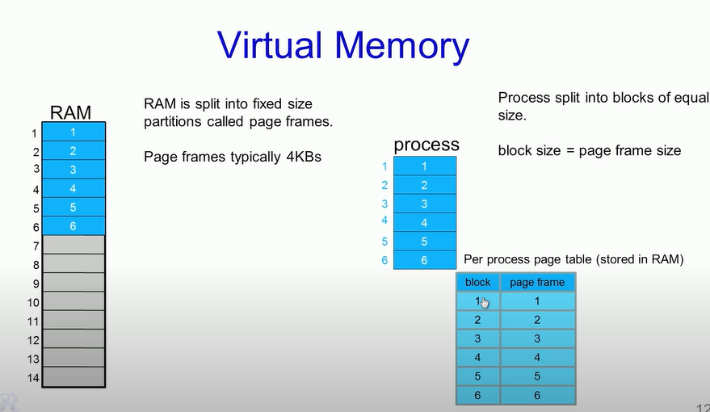
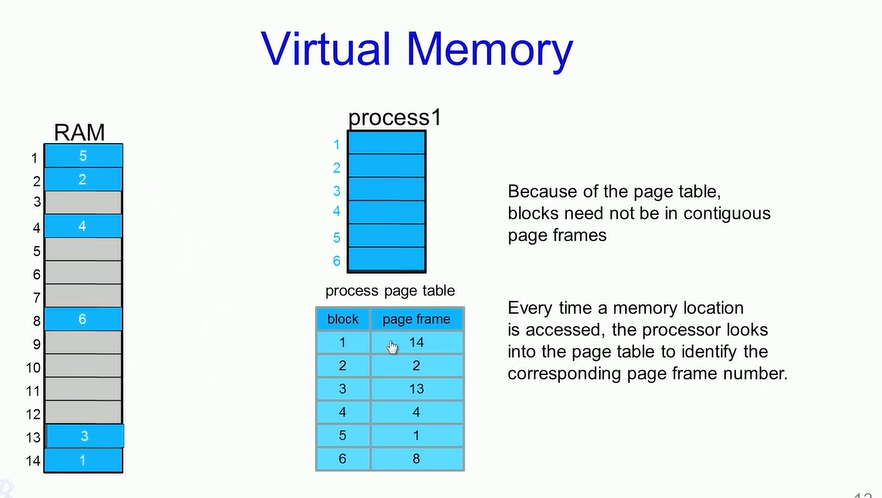
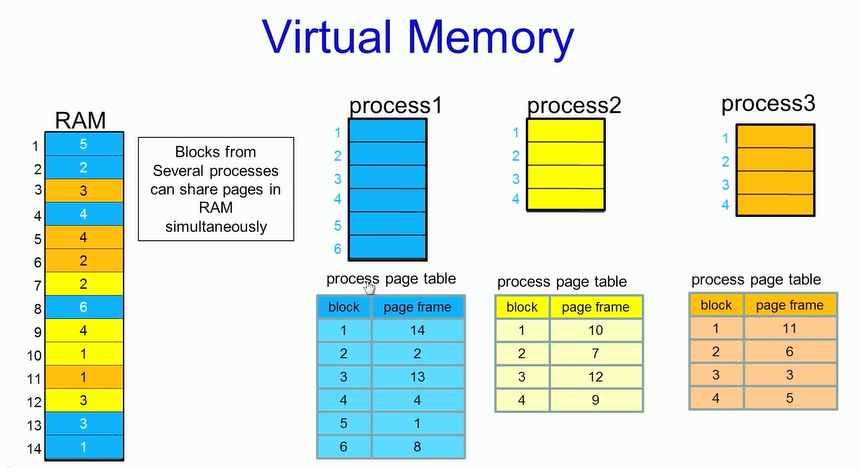
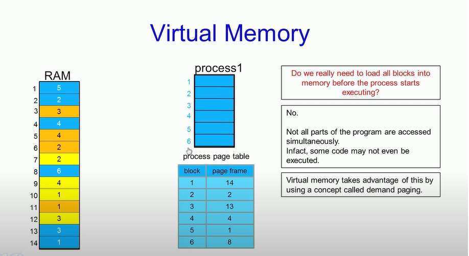
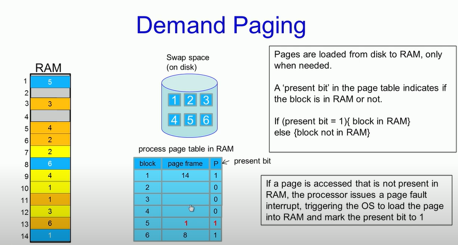
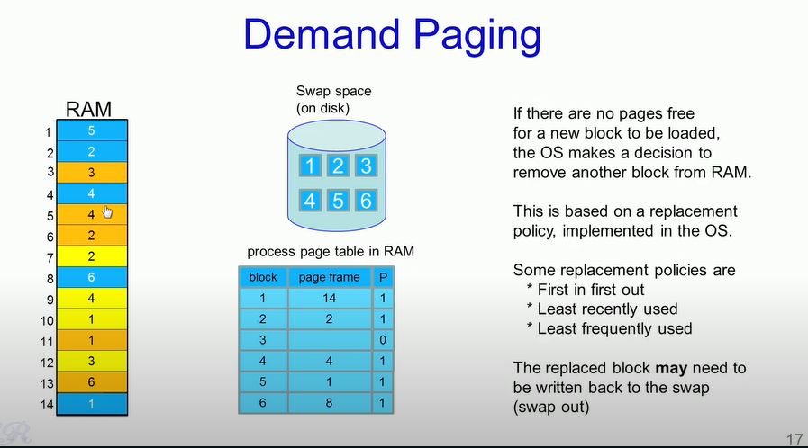
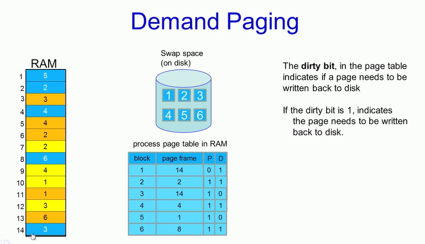
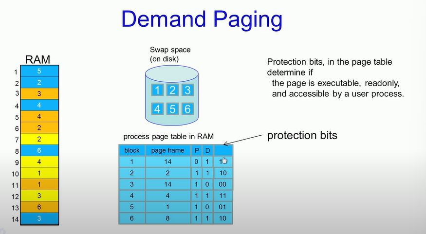

### Mapping Virtual Memory and RAM

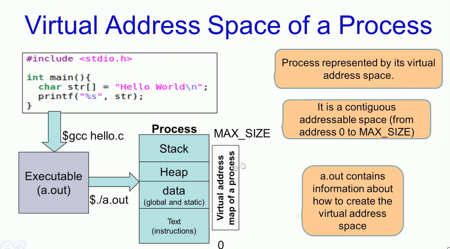
* ./a.out will create a process for us
* Process is represented by what is know as Virtual Memory
* VM is contigous address space starting from 0 and MAX_SIZE
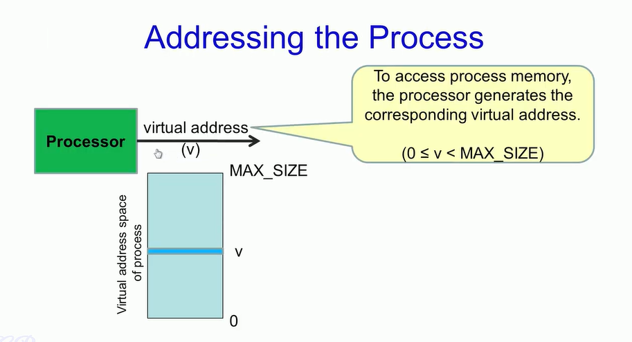
* Processor will put VM on it's BUS
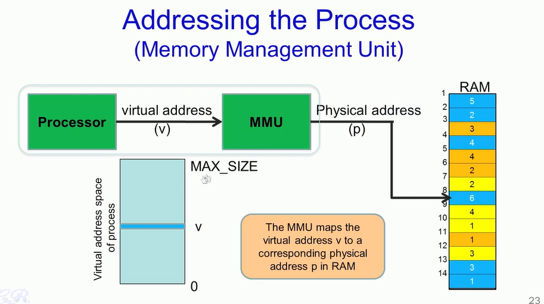
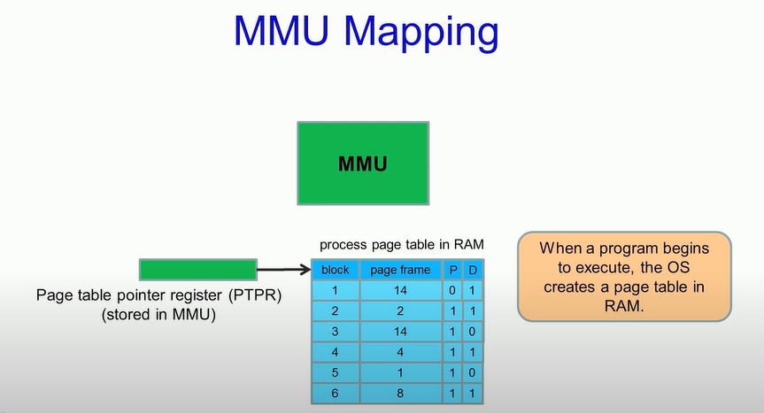

### MMU Mapping
Virtual address comprised of two parts (Table Index and offset)
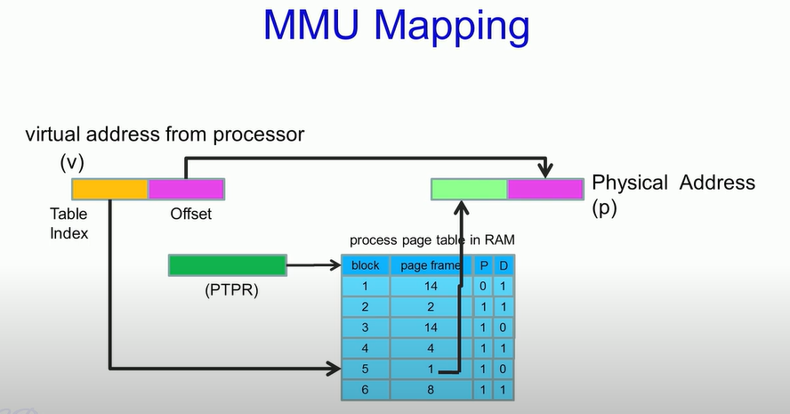
### MMU in 32 bit system
max process size is 2^32 = 4G
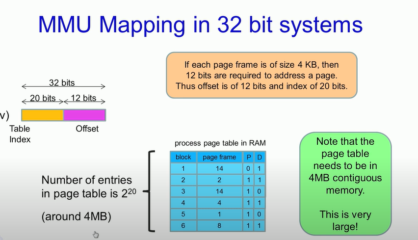
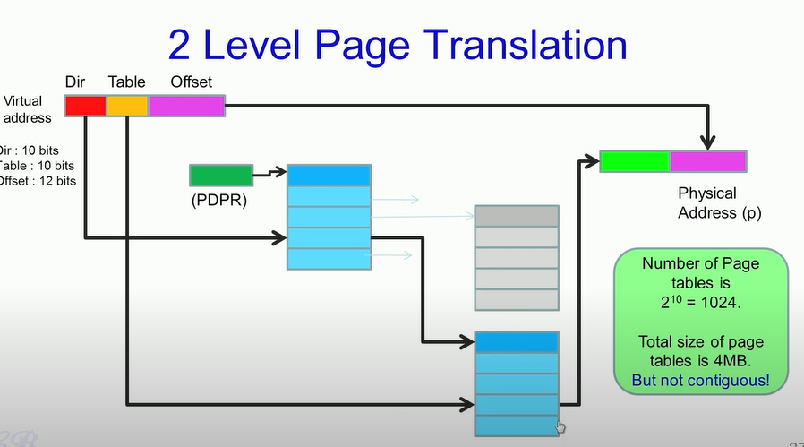
### Working of VM (Steps)
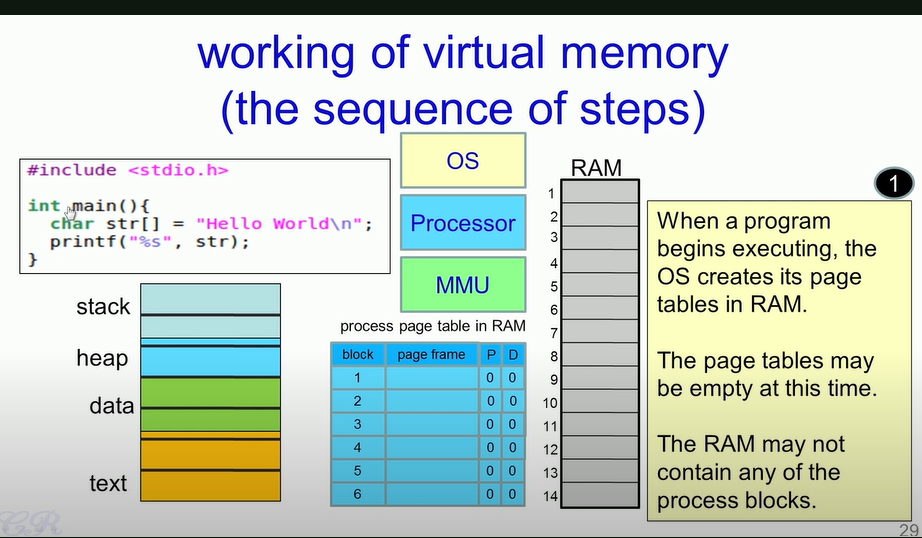
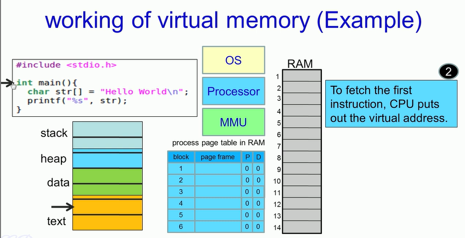
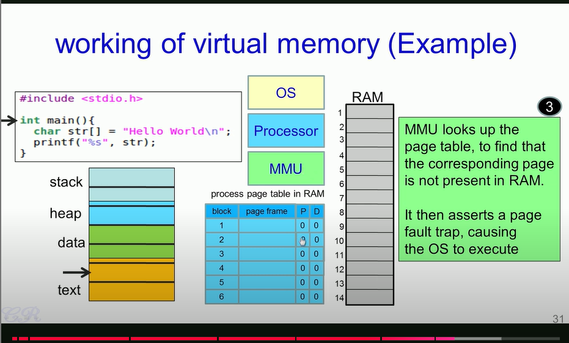
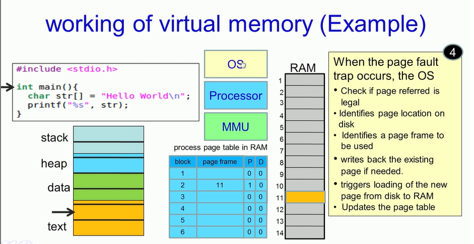
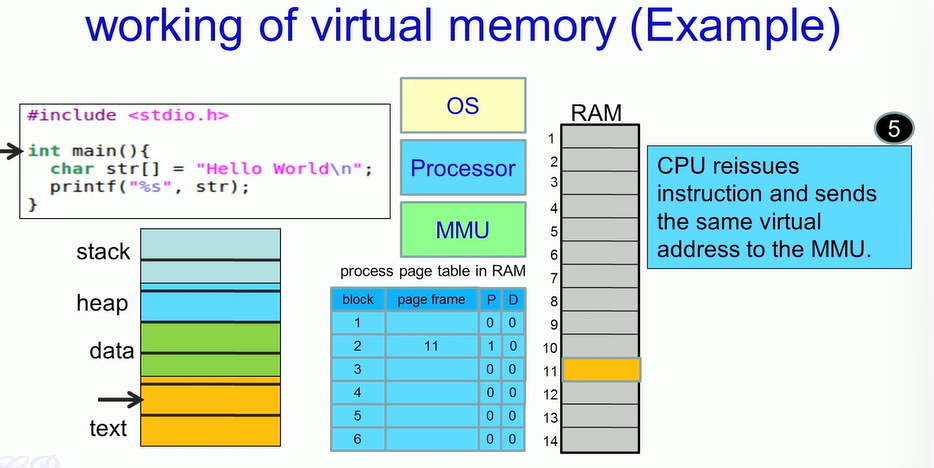
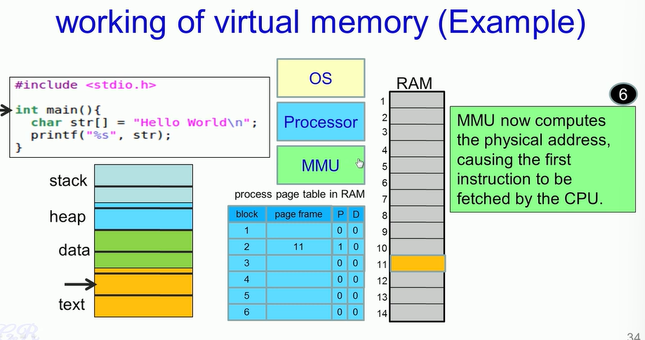

*   When user run program triggers process page table in RAM
* Transfer the control to main function
* The processor will execute the main function. So the instruction of the main method will be present in text area od the process. So that will send the virtual memory to the bus.
* The MMA wil receive the address.The check the process page. Checks If the block is present in memory.The P in process table will let us know. 
* If not present in table will trigger a page fault interupt.  
