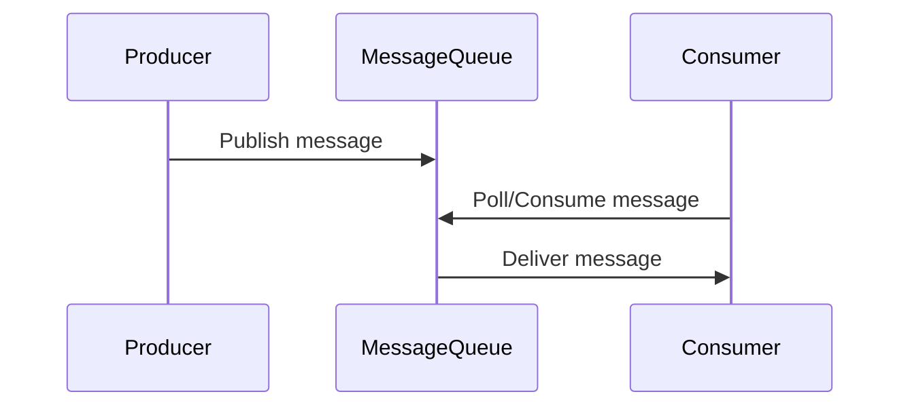

Here's the **Markdown notes** for the **Message Queue** topic:

---

## 📬 Message Queue

A **Message Queue (MQ)** is a durable system component that enables **asynchronous communication** between different parts of a system. It acts as a **buffer** and ensures **loose coupling** between services.

### 🏗️ Basic Architecture

- **Producer / Publisher**: Sends (publishes) messages to the queue.
- **Message Queue**: Stores messages until they are consumed.
- **Consumer / Subscriber**: Listens to the queue and processes messages.



---

### 🔄 Asynchronous Processing

- **Producers and Consumers work independently.**
- A producer can publish messages even if consumers are down.
- A consumer can read and process messages even if the producer is offline.

---

### 💡 Use Case Example: Photo Customization App

- Users upload images for editing (e.g., crop, blur).
- Web server (Producer) places image processing tasks in the **message queue**.
- Worker services (Consumers) fetch and process jobs asynchronously.
  
```text
Web Server --> Message Queue --> Image Processor
```

---

### ⚙️ Scalability Benefits

- **Independent scaling**:
  - If queue size grows, increase consumers to process messages faster.
  - If queue stays mostly empty, scale down workers to save resources.
- **Fault Tolerance**:
  - No data is lost if the consumer is temporarily unavailable.
- **Decoupling**:
  - Components do not depend on each other’s availability.

---

### ✅ Advantages of Message Queues

| Feature              | Benefit                               |
|----------------------|----------------------------------------|
| Asynchronous         | Fast responses for users               |
| Decoupling           | Better modularity and maintainability  |
| Load Management      | Queue helps handle traffic spikes      |
| Reliability          | Prevents data loss on consumer crash   |
| Scalability          | Easy to scale producers/consumers      |

---

### 📦 Common Message Queues

- **RabbitMQ**
- **Apache Kafka**
- **Amazon SQS**
- **ActiveMQ**
- **Redis Streams**

---

Let me know when you're ready to explore deeper into any MQ system like Kafka or RabbitMQ, or move on to the next topic from your material!